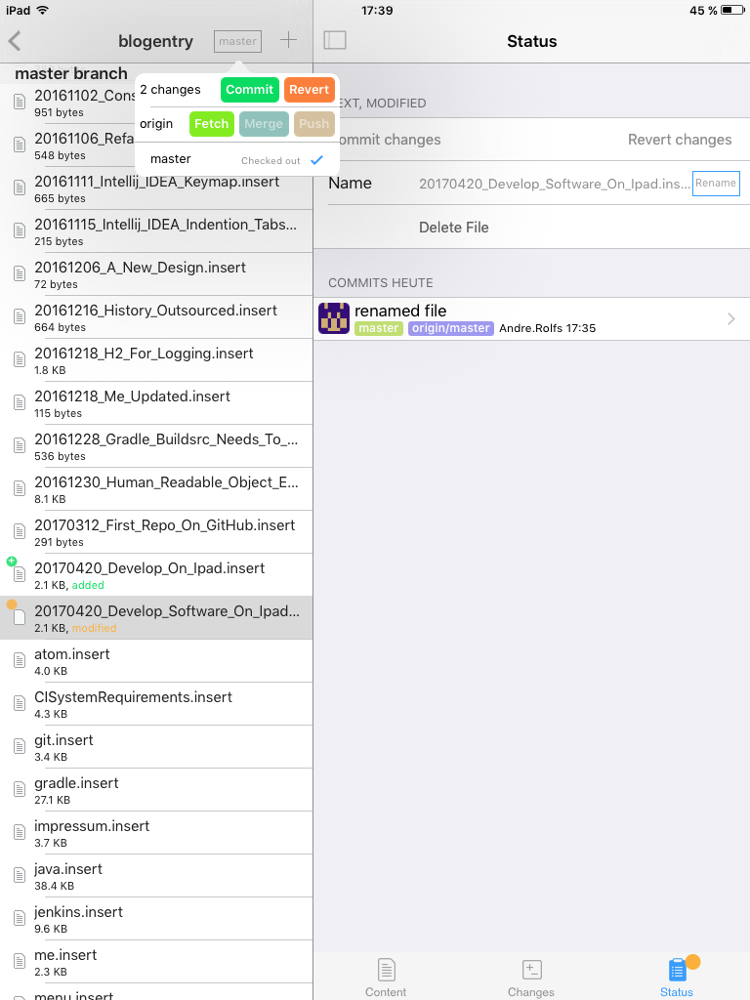
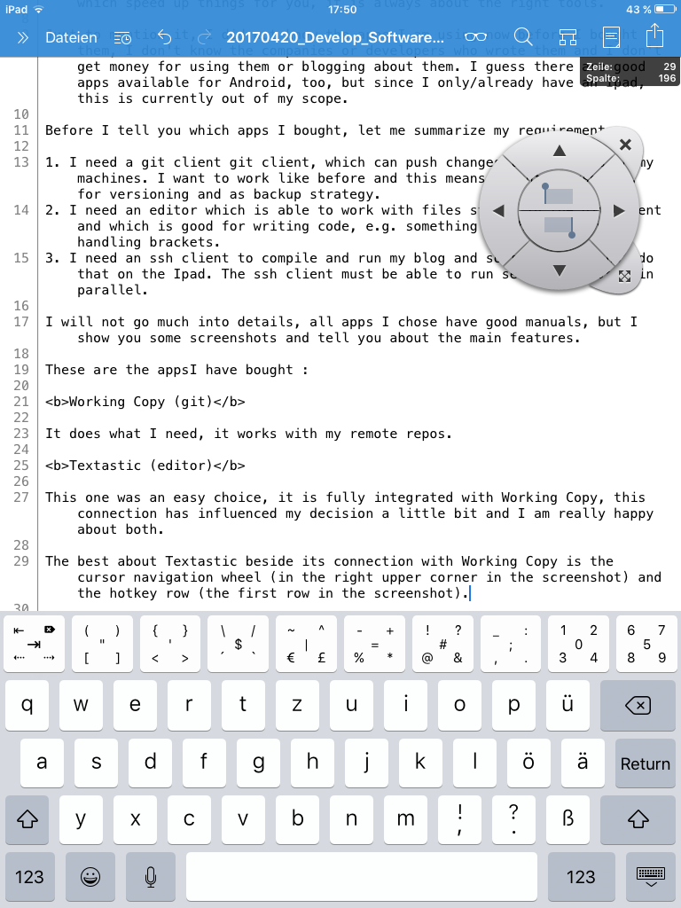
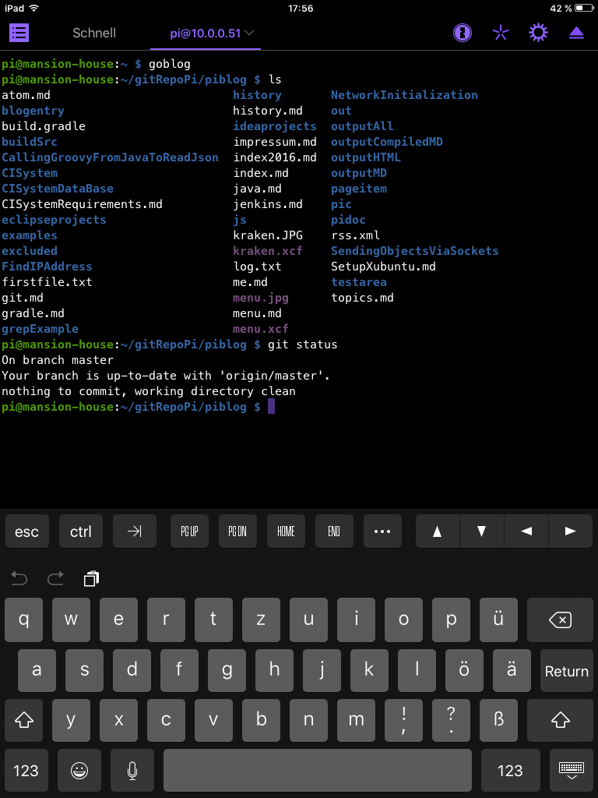



# 20170420 Develop Software On Ipad

Some changes in my life made it necessary to become more flexible regarding the time when to work on my private projects, the projects I write about in my blog. I decided working in bus and train would be the best decision, even if this gives me only 20 to 40 minutes extra time per day.

I have found out for myself, working with a notebook in the bus makes no fun, its just too shaky. I need something more robust, where other passengers stumbeling over me is no big deal and does not automatically risk my hardware. So I have chosen to work on my Ipad, since I already have an Ipad and don't need to buy a new device, I can type with one hand on it and even work while standing, waiting for the bus. Actually I am writing this blog post on it.

Developing software on Ipad works better than expected if you have apps, which speed up things for you, it is always about the right tools.

Just to mention it, I did not know the apps I am using now before I bought them, I don't know the companies or developers who wrote them and I don't get money for using them or blogging about them. I guess there are good apps available for Android, too, but since I only/already have an Ipad, this is currently out of my scope.

Before I tell you which apps I bought, let me summarize my requirements.

1. I need a git client git client, which can push changes to the repos on my machines. I want to work like before and this means I want to use git, for versioning and as backup strategy.
2. I need an editor which is able to work with files stored in the git client and which is good for writing code, e.g. something which is good with handling brackets.
3. I need an ssh client to compile and run my blog and software, I cannot do that on the Ipad. The ssh client must be able to run several sessions in parallel.

I will not go much into details, all apps I chose have good manuals, but I show you some screenshots and tell you about the main features.

These are the apps I have bought :

<b>Working Copy (git)</b>

It does what I need, it works with my remote repos.

<b>Textastic (editor)</b>

This one was an easy choice, it is fully integrated with Working Copy, this connection has influenced my decision a little bit and I am really happy about both.

The best about Textastic beside its connection with Working Copy is the cursor navigation wheel (in the right upper corner in the screenshot) and the hotkey row (the first row in the screenshot).

<b>Prompt 2 (ssh)</b>

Prompt can handle multiple sessions and you can configure a dark theme if you want.

