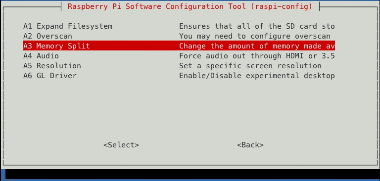

# 20170426 Raspberry Pi raspi-config

This is the first post about how I have set up my Pi.

I just write about how I did it. This does not mean I can tell you more or better about it than you can read it in other blogs, but I think I can create some value for you by scratching different topics and there are a lot of things I have already done with my Pi yet.

My aim is to get everything working on my Pi I cannot do on my Ipad, e.g. run Java and Gradle on it to compile my blog and to run my Software CISystem.

Let us start at the beginning.

I have loaded my micro SD card on Windows using Win32DiskImager, on raspberry.org you find documentation how to do it.

<b>Be careful! Check you don't need the content on your SD card anymore!!!</b>

<b>Be careful! Check you have configured the correct drive to not delete your harddisk!!!</b>

FYI : I took the screenshots on the Ipad while using the Prompt SSH client app. Then I have cut away the unneeded top and bottom of the screenshots using the IOS PHotos app.

The first step after I have loaded the Jessie light image to my micro SD card is to start the Pi and log in with

    login    : pi
    password : raspberry

FYI : maybe you have to type

    password : rasperrz

when using a <b>german keyboard</b> as your image could expect an english keyboard. I am still struggeling with the localisation, but my ssh app on Ipad solves the problem for me.

I start

    sudo raspi-config

to start with the basic configuration. First I change the password.

Then I change the hostname to mansion-house as I decided london underground stations as pool for hostnames.

I configure to boot to text console. Jessie light has no desktop installed and I don't need one.

Very important for me is to activate the SSH server on the Pi as I need it to connect from Ipad.

I have a 32GB SD card, much bigger than the image. With raspi-config you don't have to worry about partitioning to use the whole space, just expand the filesystem.

The Pi uses a part of your RAM for the display/GPU. You can configure the memory split. For text console I only need the suggested minimum of 16 MB.

That's it, now the Pi

* is secured with a new password
* has a new name
* has an SSH server running
* uses the full SD card
* uses a reasonable amount of RAM for the GPU

In my next post about how to set up the Pi I explain how I configure the network.
