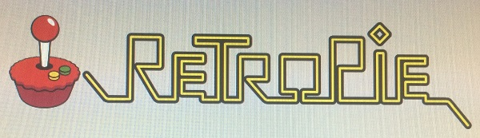
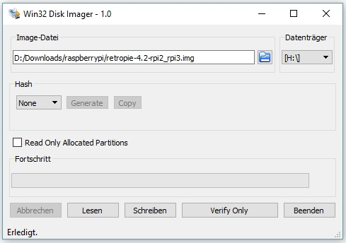
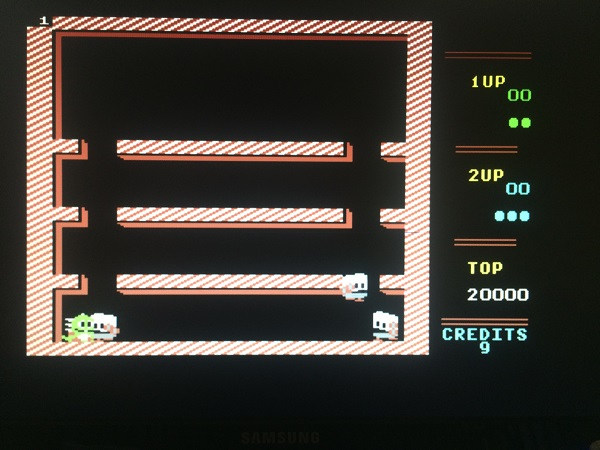
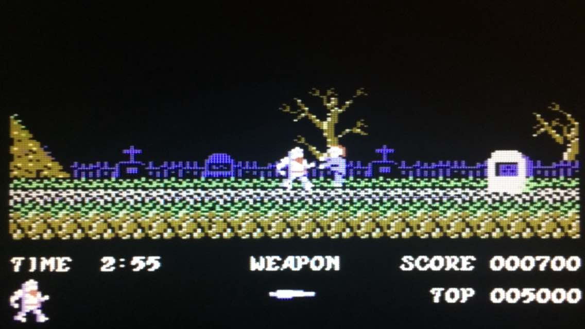



# 20170527 Raspberry Pi - Setup A Retropie To Play C64 Games

The topic of this blog post is to show how I have set up my Retropie to play C64 games on Raspberry Pi.

When I was at school I had a C64 and I loved this machine.

Some years ago the [OCM, the Oldenburger Computer Museum](http://www.computermuseum-oldenburg.de)
opened. This museum is specialized on 8-bit-machines, like C64.
OCM is a hands-on-museum, you can ask and play games on their machines.

After I had seen how much fun kids still today have playing games which were
created many years before they were born, I directly decided to give the museum my C64
and C16-Plus4 hardware. Lots of my friends did the same. You should think about it.
It is hands-on, they run and use the machines, sometimes a machine breaks down and must be repaired, they always
need hardware.

I was not unhappy about giving away my hardware, I did not use it often the last years
and one needs some room space to keep it. Room space in Munich for things you don't use every day?
Yeah.

Ok, but now I want to play some C64 games again and my experience with Raspberry Pi was so good the
last weeks, I thought I give it a try and it worked.

<b>Preparation and requirements</b>

1. You need a Raspberry Pi 3
2. You need a Micro SD card
3. I have used the [retropie-4.2-rpi2_rpi3](https://retropie.org.uk/download/) build of retropie, other builds may differ from what I describe  here
4. I use Win32DiskImager to load the image to the SD card
5. I use a keyboard, the C64 emulator provides a virtual keyboard but with a real one it is easier
6. I use 2 NES-like gamepads

<b>Load the image to the SD card</b>

<b>Be careful! Check you don't need the content on your SD card anymore!!!</b>

<b>Be careful! Check you have configured the correct drive to not delete your harddisk!!!</b>

On my machine it looks like this :

<b>First Boot</b>

While booting for the first time the filesystem is automatically resized to the full size of the SD card.

Then the welcome-screen of Emulationstation says :

<b>2 gamepads detected, hold a button on your device to configure it.</b>

I hold a button pressed and the configuration begins, just use the request button.

My NES-like gamepad has these buttons :

D-PAD UP 
D-PAD DOWN 
D-PAD LEFT 
D-PAD RIGHT 
START 
SELECT 
A 
B 
X 
Y 
LEFT SHOULDER 
RIGHT SHOULDER 

For all other requested buttons I hold a button on the pad pressed to skip it.

Then my options are :

* click the START button for the Emulationstation MENU
* click A to get to the SELECT menu for general raspberry pi and retroarch configuration
* use D-PAD to CHOOSE a simulation, but currently there are none

If you need to reconfigure your joystick or pad press START, select CONFIGURE INPUT and configure your device.

Let's go on with the general raspberry pi and retroarch configuration.

<b>WIFI</b>

Let's configure WIFI first, to update the OS and software and to install the emulators.

* press A to get into the SELECT menu
* select WIFI
* configure WIFI

<b>RETROPIE SETUP</b>

Here I first do the

* Basic install and then in
* Manage packages I select
* Manage optional packages to
* Install/Update all optional packages from binary

to get VICE (the Versatile Commodore Emulator) installed, to use it as C64 emulator.

If your SD card is small or you don't want to download all available emulators,
you can select them one by one, but at least install Vice.

<b>Get the roms to the Retropie</b>

With

    \\retropie\roms

or the same with my IP address instead of "retropie"
I can access the folders for the roms on the Pi from Windows File Explorer.

From Mac OS you

1. open Finder
2. connect with server
3. use <code>smb://retropie/roms</code> as address

For C64 you have to store them <b>unpacked</b> as <b>.d64/.t64</b> in the <code>/retropie/roms/c64</code> subfolder.

You can transfer the roms as well with a USB pendrive, how to mount it is decribed [here](http://www.raspberrypi-spy.co.uk/2014/05/how-to-mount-a-usb-flash-disk-on-the-raspberry-pi/).

(fixed 20170528)

<b>Reload/Restart</b>

Now that I have installed the C64 emulator VICE and stored the roms on the Pi, I have to tell Emulationstation to reload.

You can either restart the Pi via <b>START/QUIT/RESTART SYSTEM</b> or you leave
Emulationstation with <b>F4</b> and then start it again with <b>emulationstation</b> from shell.

<b>Now the emulators are there</b>

Now that I have installed Vice and stored the roms the Pi allows me to choose "Commodore 64".

If it is the only emulator installed with roms, it is already selected and you just need to start it with <b>A</b>.

I start a game.

<b>Gamepad and/or Keyboard not working ?!?</b>

At this point I was stuck for some time. The game was starting,
but after the intro was finished I could not start playing.

As always, I can only tell you what I did and what works for me,
I cannot tell you if this always a good or correct decision.

You have to configure VICE.

It took me some time to accept that my gamepad is configured, but VICE is not
configured to use it...

Press <b>A</b> to get into the VICE menu.

There I select

1. VICE menu
2. Machine settings
3. Joystick settings
4. Joystick device 1
5. Joystick

to change it from "none" to "joystick".

I do the same for "Joystick device 2", too.

Then I configure

1. VICE menu
2. Machine settings
3. Userport joystick adapter port 1
4. Joystick

I do the same for "Userport joystick adapter port 2"

I use an english keyboard which is identified as "American (us)" according to

1. VICE menu
2. Settings management
3. Keyboard mapping

so this ok for me.

I configure

1. VICE menu
2. Settings management
3. Active keymap
4. Positional

as this seems to work better for my keyboard.

Saving these settings is done with

1. VICE menu
2. Settings management
3. Save  current settings

<b>Playing</b>

Here I have some last hints for you if it is not working for you :

1. better have two josticks or gamepads, C64 had two, too
2. some games want their input from joystick 1, some from joystick 2, you should try both if it is not working
3. try all buttons to find the right one

Sounds funny but if Retropie is as new to you as it is for me, everything is trial and error.

<b>Sound</b>

The sound worked out of the box for me, I have just connected earphones to the sound jack.

<b>C64 Games</b>

Retropie comes without games (roms).

You can download them, there is a huge community, just google for it.

To get an idea how a C64 looks like, this is how <b>Bubble Bobble</b> looks like :

and what I really love is Ghosts'n Goblins :

last fix of this post : 20170528
